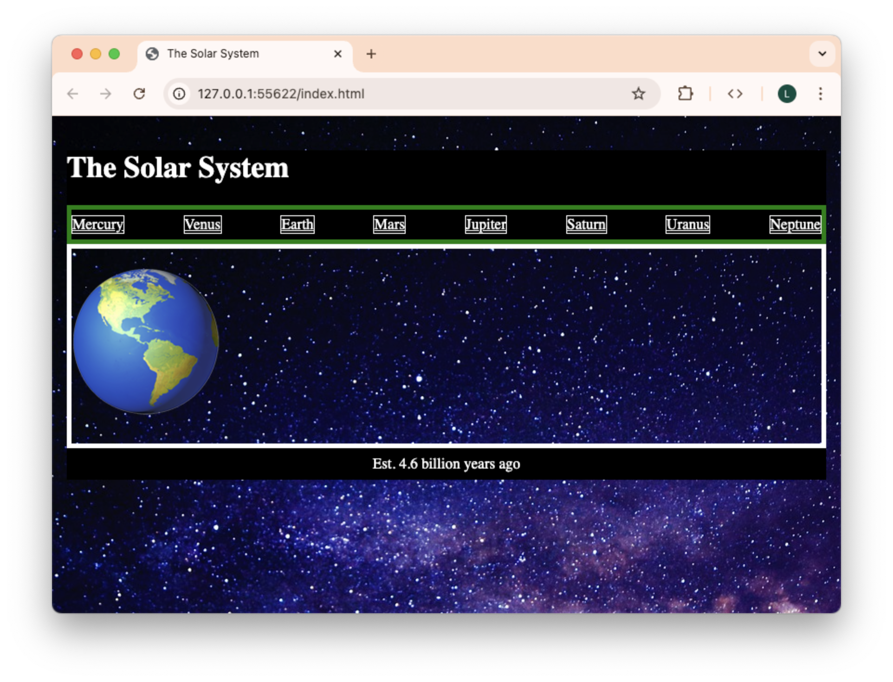
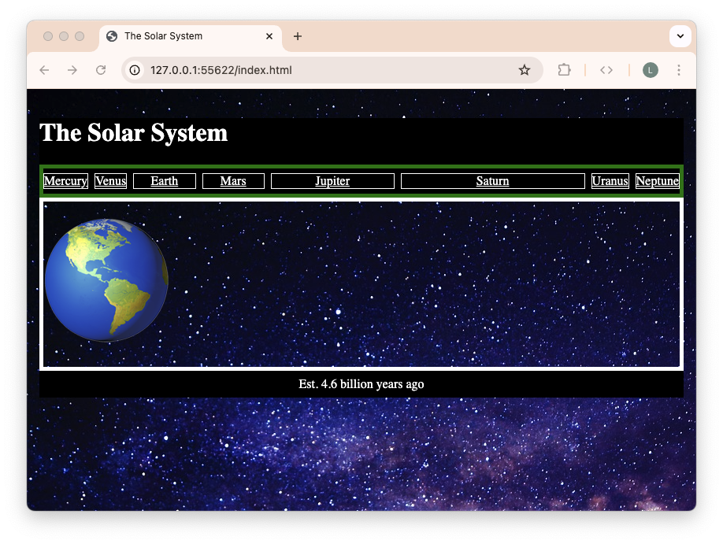
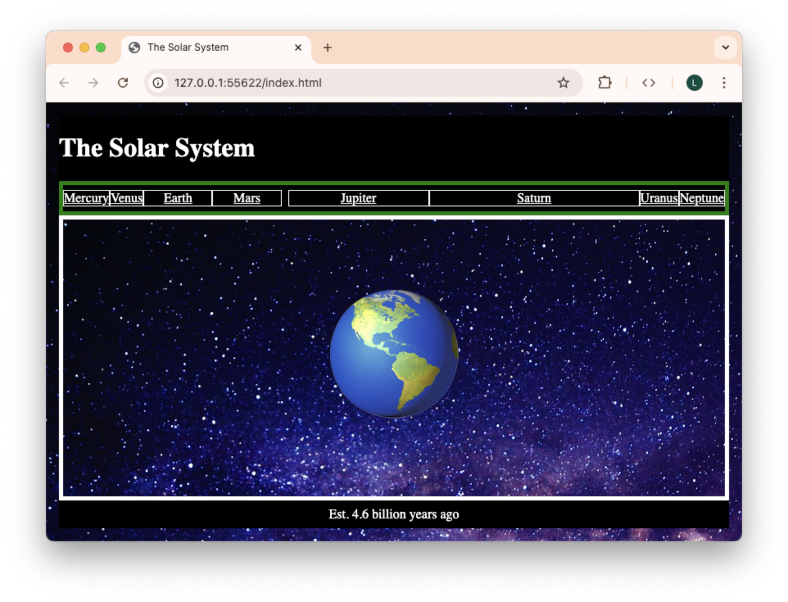

# Solar System

A **horizontal navigation bar**, or navbar for short, is a common design pattern that you'll notice at the top of many websites. Navigation links are displayed as a horizontal bar. In this guided practice, you'll explore some foundational flexbox concepts by positioning and sizing a navbar for the solar system!

## Instructions

1. Each person in the group should clone this repository down to your local machine. This will not be submitted.
2. Open the cloned folder with VS Code.
3. Live serve `index.html` to see the starting point for this guided practice.
4. Choose one person in your group to be the **Driver** initially. Everyone else will be a **Navigator**. These roles will swap after each section.
5. As a team, read each question out loud and reach a consensus on the answer before moving to the next question.
6. Every person in the team should follow along and type the answers on their own computers.

> [!NOTE]
>
> This guided practice comes with some pre-written HTML and CSS to allow you to focus on flexbox. In particular, borders have been added to the elements to help visualize the effects of different flex properties.

## Position items along flexbox axes

`Flex-direction` determines the **main axis** of the flexbox. The **cross axis** runs perpendicular to the main axis.

1. Style `nav` to be a flexbox by setting `display` to `flex`.
2. Set `flex-direction` to `column`, which will set the main axis to be vertical. Is the cross axis now horizontal or vertical?
3. How does the **start** and **end** of the main axis change if `flex-direction` is set to `column-reverse`?
4. Remove the `flex-direction` declaration. What is the default value of `flex-direction` if it is not set?
5. Set the `gap` to `1ch`. On which axis does `gap` add spacing?

Flex items can be repositioned along an axis. **Justify** will move items along the main axis, while **align** will move items along the cross axis. **Items** refers to the items themselves, while **content** refers to the _spacing_ between the items.

> [!WARNING]
>
> In flexbox layouts, the property `justify-items` is ignored. See [MDN](https://developer.mozilla.org/en-US/docs/Web/CSS/CSS_box_alignment/Box_alignment_in_flexbox) for more information.

6. According to the definitions above, what would the property `justify-content` change?
7. What would the property `align-items` change?
8. Style `nav` so that its children are evenly distributed along the main axis. Mercury should be flush with the left edge, and Neptune should be flush with the right edge. The children should also be centered along the cross axis.

Before continuing to the next section, select another person to be the Driver.

## Change the sizing of flex items

One major benefit to using flexbox is that the size of a flex item is _flexible_ along the main axis. A flexbox container will keep track of the **free space** and distribute it according to the needs of its flex items. This means that a flex item can **grow** or **shrink** depending on the space available.

9. Set the `flex-grow` property of `#earth` to `1`. What happens?
10. Set the `flex-grow` property of `#mars` to `1`. What happens?
11. Set the `flex-grow` property of `#jupiter` to `2`. What happens?

Currently, the total **grow factor** is $1+1+2=4$. This determines the _ratio_ of how the free space is distributed.

12. What fraction of the free space do Earth and Mars get?
13. What fraction of the free space does Jupiter get?
14. Set the `flex-grow` property of `#saturn` to `3`. What fraction of the free space do Earth, Mars, and Jupiter now get?
15. To adjust the size of flex items, is the `flex-grow` property changed for the flexbox container or the flex items?
16. How does `gap` affect a flexbox's free space?

> [!NOTE]
>
> `flex-shrink` works in very much the same way as `flex-grow`. _Extra_ free space is distributed according to the grow factor of each item. If there is not enough space, then each item shrinks according to their **shrink factor**.

Before continuing to the next section, select another person to be the Driver.

## Nest flexbox containers

A flexbox container can only rearrange its _direct_ children. Flexbox containers can be _nested_ in order to rearrange further descendants.

17. In the HTML, wrap the links for the first four planets in a `section` with two classes: `inner` and `planets`. Wrap the links for the last four planets in a `section` with two classes: `outer` and `planets`. What happens?
18. Why do the previously-set grow factors no longer apply?
19. Set the grow factors of the two sections so that the `outer` section is twice as big as the `inner` section.
20. Write a rule to flex all elements with the class `planets`. This will cause the grow factors to be applied because each planet link is once again a direct child of a flex container. Why are the planet size ratios different from before?
21. What fraction of the inner planets' free space do Earth and Mars now take?
22. What fraction of the outer planets' free space do Jupiter and Saturn now take?

At this point, our `nav` is a flexbox that rearranges the `section`s, each of which is _also_ a flexbox that rearranges the individual links for each planet.

Before continuing to the next section, select another person to be the Driver.

## Center an element

Another common use case of flexbox is to center an element within its parent. This used to be much more difficult before flexbox, but now it's relatively straightforward!

23. Look at the provided HTML file. What are the direct children of `body`?
24. Flex the `body` as a `column` and set the grow factor of `main` to `1`. What do you think this will change? Make this prediction _before_ writing the CSS.
25. Did anything change? How much free space is available in `body`?
26. Set the `height` of `body` to `100vh`. What happens now?
27. What is the relationship between a flexbox container's size, main axis, and free space?
28. Put it all together! Style `main` so that the planet emoji is centered within its borders.

