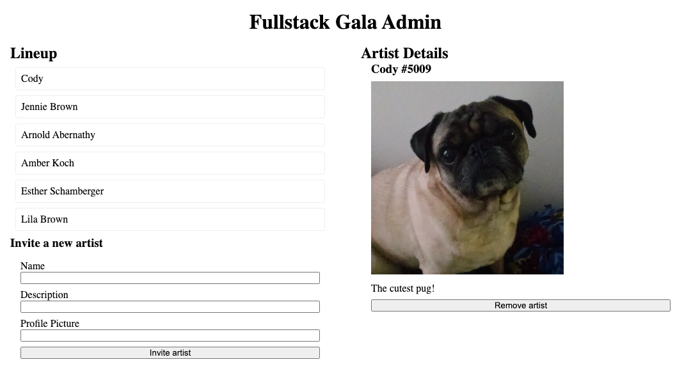

# Fullstack Gala Admin

The [Fullstack Convention Center](https://fsa-crud-2aa9294fe819.herokuapp.com/api/) often invites a variety of artists to perform. Previously, you built a public platform where all visitors can view information about the associated artists. Now, you'll build the admin interface to allow administrators to invite or remove artists.

## Instructions

1. Clone this repository down to your local machine and open it with VS Code. This will not be submitted.
2. Designate one person in your group to be the initial Driver. Everyone else will be a Navigator.
3. Read the existing code.

> [!WARNING]
>
> Set the `COHORT` code in `index.js` to your cohort + your name (e.g. `2506-JOHN`).
> You don't want your classmates to delete your data while you're working, and vice versa!

## Invite a new artist

1. Complete `addArtist` to make a `POST` request to the API with the given artist information. If successful, it should query the API again for all artists.
2. Add an event listener to `NewArtistForm` so that when it is submitted, `addArtist` is called with the information that the user typed into the form.

You should now be able to add a new artist via the form. The page should also automatically refresh to show the newly invited artist. Designate a new person to be the Driver before continuing to the next section.

## Remove the selected artist

3. Complete `removeArtist` to make a `DELETE` request to the API with the given artist ID. If successful, it should clear `selectedArtist` and query the API again for all artists.
4. Add an event listener to the button in `ArtistDetails` so that when it is clicked, `removeArtist` is called with the ID of the selected artist.

> [!WARNING]
>
> When you test your code, try not to delete the pre-existing data. You won't be able to get the data back until the next database reset!
> To be safe, delete only the artists that you created yourself.

Users will now be able to remove the selected artist by clicking the button. The page should automatically update to reflect these changes.

The Fullstack Convention Center administrators will be super pleased with your work!
